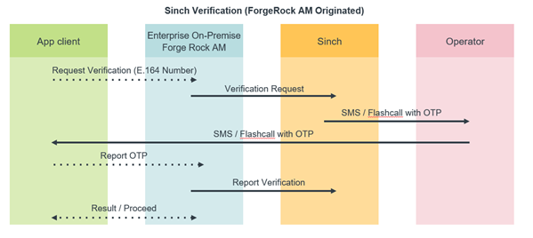
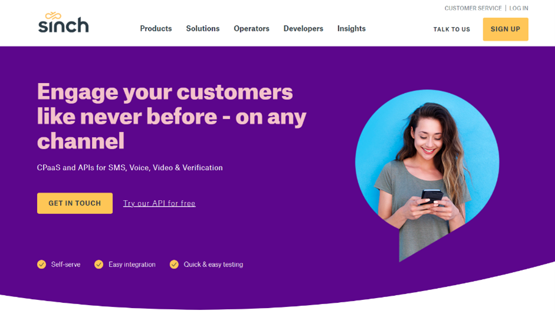
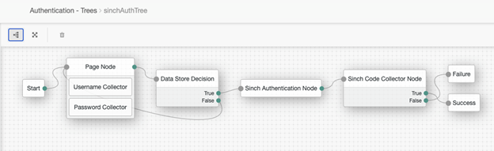

**Details**

**Categories:** ForgeRock Access Management

**License:** Unkown

**Supported by:** [Sinch](https://go.sinch.com/l/151751/2021-02-26/ywl2mp)

**Repository:**  [Sinch GitHub Repository](https://go.sinch.com/l/151751/2021-02-26/ywl2m5)

# Sinch CPaaS
**[Sinch](https://go.sinch.com/l/151751/2021-02-26/ywl2mp)** is a global Communications Platform as a Service (CPaaS) which offers Marketing, Commerce, and Support teams AI driven CX automation tools and a complete set of messaging, rich media, voice, and video channels. In addition to its communication channels and network connectivity Sinch provides a robust and flexible Verification service powering user registration, account recovery, authentication, and phone number validation use cases.    

# About Sinch Verification
Sinch Verification consists of different software development kits – the Sinch SDKs – that you integrate with your smartphone (iOS, Android) or web application.  Coupled to   the Forge Rock Access Management, Sinch Verification can enable global SMS, Flash Call, and Voice IVR Callout verification and One Time Passcode (OTP) services for your customer mobile applications and online services.

The Sinch Verification methods include:
1. **[SMS](https://go.sinch.com/l/151751/2021-02-26/ywl2my)**  - Number is verified using a configurable length 4-8 digit code that is sent in a SMS message. On Android, automatic code extraction is available, however on iOS an input field must be always presented and the number has to be typed manually by the user.
2. **[Flash Call](https://go.sinch.com/l/151751/2021-02-26/ywl2n1)**  - Flash Call is a Caller Line Identifier (CLI) driven verification method with a superior UX on Android devices.  _(Ask Sinch team for more details on Flash Call release date, our first release of the Forge Rock Sinch Auth Node does not include Flash Call support.)_
3. **[Voice Call Verification](https://go.sinch.com/l/151751/2021-02-26/ywl2n3)**  - User obtains the verification code by answering an incoming Sinch phone call, during which text-to-speech software will speak it out loud. The code has to be typed manually.

# Sinch Auth Node
The ‘sinchAuthNode’ is a simple authentication node for **[ForgeRock's Identity Platform](https://www.forgerock.com/platform/)** 5.5 and above. This node integrates Sinch phone number verification service with Forge Rock AM. Currently this version of the plugin supports verifications via SMS, Flash Calls and callouts.
How does Sinch Auth Node work?  Once configured, the Forge Rock AM integrated Sinch Auth Node allows your mobile (iOS/Android) and web apps to initiate a phone number verification through Sinch communications platform.  Exemplary flow as follows:

# Sinch Auth Node Usage
Copy the .jar file from the releases tab of Github into the ../web-container/webapps/openam/WEB-INF/lib directory where AM is deployed. Restart the web container to pick up the new node. After the web container restart the node will appear in the authentication trees components palette.
The code in this repository has binary dependencies that live in the ForgeRock maven repository. Maven can be configured to authenticate to this repository by following the following **[ForgeRock Knowledge Base Article](https://backstage.forgerock.com/knowledge/kb/article/a74096897)**.

# Getting Started
To begin, you will need to contact Sinch Enterprise sales team via email at: forgerock@sinch.com.  A Sinch Sales executive will contact you to discuss pricing, enable [Sinch portal](https://go.sinch.com/l/151751/2021-02-26/ywl2nc) test access, and provide service credits for your development team to begin integration.

 
Once you have access to the Sinch **[“Voice, Video, and Verification”](https://go.sinch.com/l/151751/2021-02-26/ywl2nc)** portal you may:
1.	**Create an App** – A Sinch App provides you with the App Token and App Secret you will need for the Sinch Auth Node configuration.
2.	**Download Sinch iOS/Android SDKs** – If you plan to integrate the Forge Rock Sinch Auth Node with your iOS and Android mobile apps you will need to [download Sinch example SDKs](https://go.sinch.com/l/151751/2021-02-26/ywl2n5) and read [Sinch Verification Developer Documentation](https://go.sinch.com/l/151751/2021-02-26/ywl2n7).
3.	**Access Sinch Verification Reports** – View, troubleshoot, and export Sinch Verification transactions events.  

# Sinch Authorization Node Functionality & Configuration
Sinch Authorization Node Functionality & Configuration
The SinchAuthorizationNode initiates the verification process. By default it looks into identityPhoneNumberAttribute passed as a configuration option (username is acquired by checking the username field of shared state). If no phone number is present the node displays a user a page where the phone number can be typed and used for verification purposes. Properties of the node:
*	**appKey** - Application key for your application found in the Sinch Verification Portal dashboard.
*	**appSecret** - Application secret for your application found in the Sinch Verification Portal dashboard.
*	**verificationMethod** - Verification method used to verify the phone number.
* **identityPhoneNumberAttribute** - Attribute used to get user's phone number from identities store.

# Sinch Code Collector Node
The SinchCodeCollectorNode node prompts the user to enter the verification code that depending on the chosen verification method is:
* **SMS** – The OTP code is sent via text message for the user to read and input the code for submission.
*	**Voice Call Verification** - The OTP code is spoken by the text-to-speech engine for the user to then input and submit.

# Sinch Auth Node Example flow
The example flow presents a Forge Rock AM enabled login page where user enters his credentials, then if present it validates the number taken from the profile or asks the user to enter it manually.

The sample code described herein is provided on an "as is" basis, without warranty of any kind, to the fullest extent permitted by law. ForgeRock does not warrant or guarantee the individual success developers may have in implementing the sample code on their development platforms or in production configurations.
ForgeRock does not warrant, guarantee or make any representations regarding the use, results of use, accuracy, timeliness or completeness of any data or information relating to the sample code. ForgeRock disclaims all warranties, expressed or implied, and in particular, disclaims all warranties of merchantability, and warranties related to the code, or any service or software related thereto.
ForgeRock shall not be liable for any direct, indirect or consequential damages or costs of any type arising out of any action taken by you or others related to the sample code.

